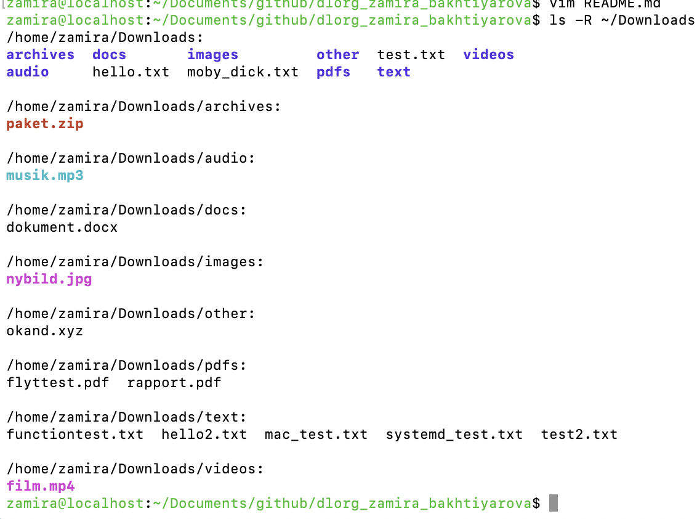

# dlorg

This project is part of the Linux fundamentals course.

dlorg is a Bash script that monitors the Downloads directory and organizes files based on their file type. The script uses inotifywait to detect new files and Bash control structures to decide where the files should be moved. 

## FILE CATEGORIES

The files are organized into these directories: 

- ".txt" to  "text/"
- ".pdf" to "pdfs/"
- ".png", ".jpg", ".jpeg" to "images/"
- ".docx" to  "docs/"
- ".mp3", ".wav" to "audio/"
- ".mp4", ".mov" to "videos/"
- ".zip", ".tar", ".gz" to "archives/"
- Other file types to "other/"

## HOW IT WORKS 

The script uses "inotifywait" to monitor the Downloads directory for file events. a "while" loops reads the filename and a "case" statement cheks the file type.

The function "organize-file" creates the correct directory with "mkdir -p" it does not already exists, and then moves the file with "mv". 

## HOW TO RUN

Make sure "inotify-tools is installed.

Run the script from the repository: 

./dlorg

The script will keep monitoring the Downloads directory until it is stopped with Ctrl+C.

## INSTALLATION

Clone the GitHub repository:

git clone https://github.com/zami66g-ux/dlorg_zamira_bakhtiyarova.git

Go to the repository:

cd dlorg_zamira_bakhtiyarova

Make the script executable:

chmod +x dlorg

Create a symbolic link:

mkdir -p ~/.local/bin
ln -s "$PWD/dlorg" ~/.local/bin/dlorg

## RUNNING WITH SYSTEMD

I used systemd to run dlorg as a background service.

First, create the user service directory:

mkdir -p ~/.config/systemd/user

Copy the included dlorg.service file to the systemd user directory:

cp dlorg.service ~/.config/systemd/user/

The service uses Type=simple and starts the script
from ~/.local/bin/dlorg.

Reload systemd:

systemctl --user daemon-reload

Enable the service:

systemctl --user enable dlorg.service

Start the service:

systemctl --user start dlorg.service

Check if the service is running:

systemctl --user status dlorg.service

The service starts automatically when the user
session starts.

## TESTING

I tested dlorg by creating files with different
extensions in the Downloads directory.

The files were automatically moved into the
correct directories.

I also tested moving a file from my Mac to the
Linux virtual machine using scp.

Finally, I restarted the Linux virtual machine
and confirmed that the systemd service started
automatically after login.

## SCREENSHOTS

The screenshot below shows how dlorg organizes files
into different directories based on their file types.

